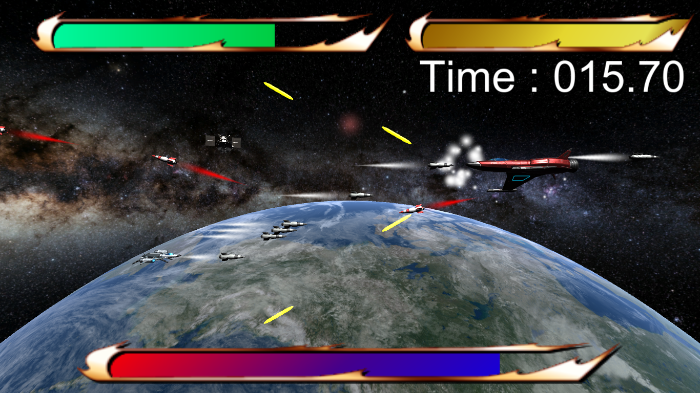
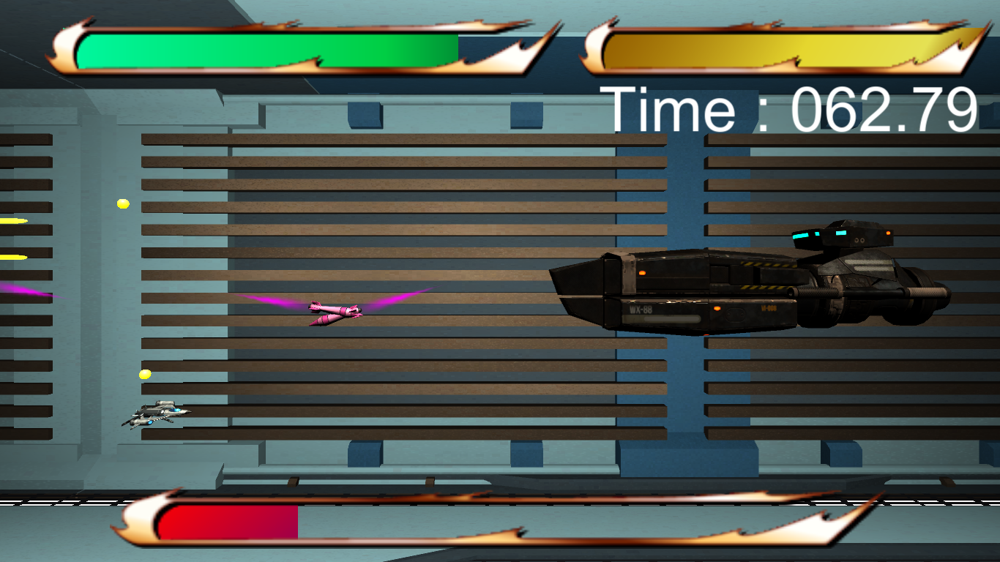
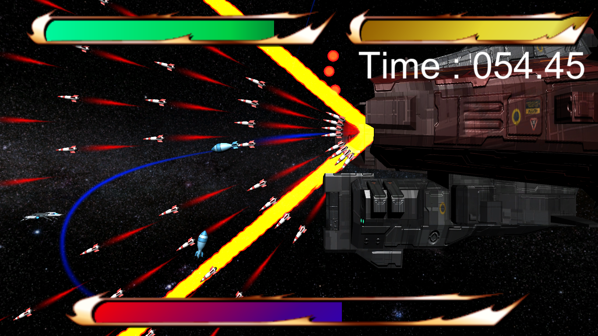

<a href="../../">TOP</a>
　＞　<a href="../">ゲーム紹介</a>
　＞　WE ARE RIGHT

WE ARE RIGHT

<h2>～概要～</h2>

このゲームは、出てくる敵を倒すというシンプルなシューティングゲームです。

しかし、ゲームのルールこそシンプルですが、出てくる敵はとても個性的です。
 
派手な動きや攻撃など相手の一挙一動を楽しむことが出来ます。

しかし、そんな敵に屈してはいけません。
 
こちらも無限に備えれらている弾と必殺のレーザー光線で立ち向かいましょう!

相手のHPを0にした時、貴方は戦いに勝ちます。
 
決して相手に屈せず相手のHPを0にするため、頑張りましょう!

<h2>～ゲーム画面～</h2>

<h2>～操作方法～</h2>

●キーボード操作

WASD or 方向キー : それぞれの方向に動く
 
Space : 弾を発射
 
Left Shift : ビームを発射
 
Esc : 強制終了

●ゲームパッド操作

方向キー : それぞれの方向に動く
 
ショットボタン : 弾を発射
 
ビームボタン : ビームを発射

<h2>～動作環境～</h2>

Windows 10 (64 bit版)

macOS Big Sur 以降 (Universal 対応)

ubuntu 20.04 (64 bit版) 以降

(注意)

macOS 版で、もし「壊れているため開けません。ゴミ箱に入れる必要があります。」と表示されて起動できない場合は、ターミナルを開き、アプリを展開したフォルダに移動してから以下のコマンドを実行して下さい

$ xattr -rc WAR.app

<h2>～ダウンロード～</h2>

<a href="https://drive.google.com/uc?export=download&id=1GRO4tLs5IkgWiSlBzv7GYqjjyUw7W0RF">
Windows版 （最終更新日 2020/12/23) </a>

<a href="https://drive.google.com/uc?export=download&id=1AbV6WFJp24nLBFs1pDkOkEElRPmJsAnW">
macOS版 （最終更新日 2020/12/23)  </a>

<a href="
https://drive.google.com/uc?export=download&id=1LTz2YMzDr3bR8gCl5vi_mH0tomytu3qR">
ubuntu版 （最終更新日 2020/12/23) </a>

<h2>～免責事項～</h2>

作者及び各リソースの制作者はこのゲームの利用により生じたいかなるトラブルや損害・損失に対し一切の責任を負いません。

<h2>～クレジット、ライセンス～</h2>

Copyright (c) 2020 チーム「函館高専ゲームプログラミング研究会」 All Rights Reserved.
 
ライセンス: <a href="../../other/HGPKLv1.html">HGPKL, Version 1</a>

ゲーム内で使用している素材について詳細は<a href="./readme.txt">こちら</a>を参照してください。

