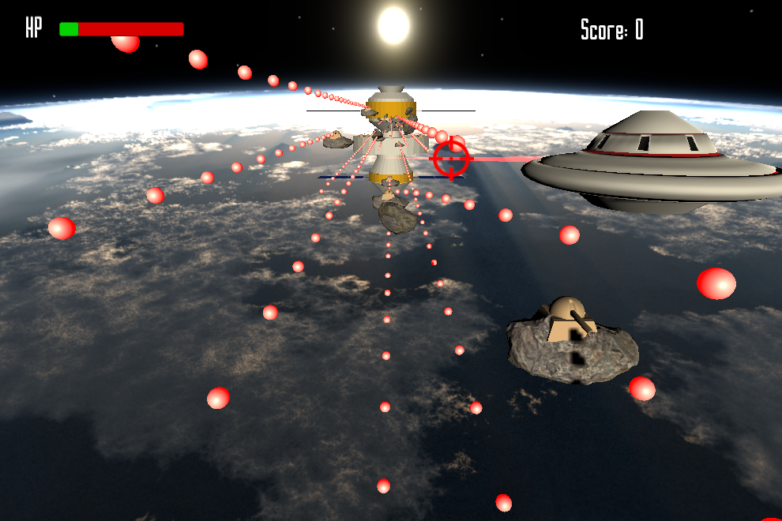

<a href="../../">TOP</a>
　＞　<a href="../">ゲーム紹介</a>
　＞　AGGRESSION

AGGRESSION

<h2>～概要～</h2>

惑星ハコダテの宇宙人であるあなたは単身地球への侵攻を開始する。

立ちはだかる地球の軍勢を一掃し地球を自らの手中とするのだ！

<h2>～ゲーム画面～</h2>

<h2>～操作方法～</h2>

WASDキー：移動(上下左右)

マウス移動：射線を変更

左クリック：射撃

ESCキー：ゲームを終了

<h2>～動作環境～</h2>

Windows 10 (64 bit版)

macOS Catalina 以降

ubuntu 18.04 (64 bit版) 以降

<h2>～ダウンロード～</h2>

<a href="https://drive.google.com/uc?export=download&id=1aW3mMJTYNKPVFV1GmgFu5hReZRH_CEs2">
Windows版 （最終更新日 2020/11/23) </a>

<a href="https://drive.google.com/uc?export=download&id=1hgZDQyO03ou92NH-QmMHMkFqC7OJCtt8">
 macOS版 （最終更新日 2020/11/23) </a>

<a href="https://drive.google.com/uc?export=download&id=1EZ1-c6rH5IaxYG5fSb-ckXch2kCM30bW">
ubuntu版 （最終更新日 2020/11/23) </a>

<h2>～免責事項～</h2>

作者及び各リソースの制作者はこのゲームの利用により生じたいかなるトラブルや損害・損失に対し一切の責任を負いません。

<h2>～クレジット、ライセンス～</h2>

Copyright (c) 2019-2020 AGGRESSION開発チーム All Rights Reserved.
 
ライセンス: <a href="../../other/HGPKLv1.html">HGPKL, Version 1</a>

