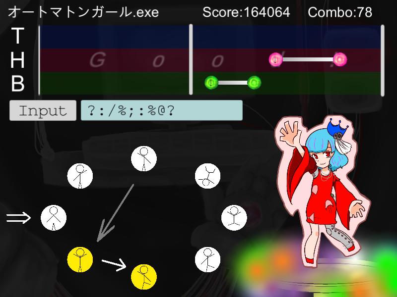

<a href="../../">TOP</a>
　＞　<a href="../">ゲーム紹介</a>
　＞　オートマトンガール.exe

オートマトンガール.exe

<h2>～概要～</h2>

曲に合わせて、ノーツを処理する音ゲーです。  

各ノートには1つずつ入力記号が割り当てられており、上手く処理すると、オートマトンの状態が遷移します。
 
横にいる「オートマトンガール」はオートマトンの状態によってポーズを変え、ダンスをします。  

上手にプレイして高得点を取り、オートマトンガールを楽しく躍らせるのが目的です。

<h2>～ゲーム画面～</h2>

<h2>～操作方法～</h2>

画面遷移：Enterキーで次の画面へ Escキーでゲーム終了

(以下、曲のプレイ画面について)  
 
上・中・下の三段にノーツが配置されます。
 
スライダーが画面を往復するので、ノートと重なったらその段に対応するキーを押します。  
 
各段について、上・中・下の順にT, H, Bキーが対応しています。

ノーツの種類はシングルノーツとロングノーツの2つがあります。  
 
シングルノーツはスライダーが重なったらタイミング良く対応するキーを叩きます。  
 
ロングノーツは始点と終点のノートがあり、2つが棒でつながれているノーツです。
 
始点とスライダーが重なったらキーを押し、棒の上にスライダーがあるうちは押したままにします。
 
終点が来たら速やかにキーを離します。

<h2>～楽曲紹介～</h2>

デフォルトでは次の3曲が収録されています。
 
難易度が低い順にCoin Rain, オートマトンガール.exe, Hammer Cityとなっています。
 
全作詞・作曲・編曲 Ken Kです。

<b>Coin Rain</b>
 
<audio src="./coinrain.mp3" controls>

<b>オートマトンガール.exe</b>
 
<audio src="./agirl.mp3" controls>

<b>Hammer City</b>
 
<audio src="./hammercity.mp3" controls>

Copyright (c) 2020 Ken K, All Rights Reserved.

<h2>～楽曲の追加方法～</h2>

「オートマトンガール.exe_Data」フォルダ内の「Songs」フォルダに譜面のjsonファイルと楽曲のwavファイルを置きます。
 
jsonとwavのファイル名は同じにしてください。  
 
setchi様の<a href="https://github.com/setchi/NoteEditor">Note Editor]</a>を使って譜面作成をするのがオススメです。

<h2>～スコアについて～</h2>

コンボが続けば続くほど、1ノーツ当たりの加点が増えます。
 
最終スコアで以下のようにランク付けされます(天井点は大体100万点前後になります)。

90万点以上 : S  
 
70万点以上90万点未満：A  
 
50万点以上70万点未満：B  
 
30万点以上50万点未満：C  
 
30万点未満：Z

<h2>～動作環境～</h2>

Windows 10 (64 bit版)

macOS Big Sur 以降 (universal対応)

ubuntu 20.04 (64 bit版) 以降

<h2>～ダウンロード～</h2>

<a href="https://drive.google.com/uc?export=download&id=1aW3mMJTYNKPVFV1GmgFu5hReZRH_CEs2">
Windows版 （最終更新日 2020/12/19) </a>

<a href="https://drive.google.com/uc?export=download&id=1hgZDQyO03ou92NH-QmMHMkFqC7OJCtt8">
 macOS版 （最終更新日 2020/12/19) </a>

<a href="https://drive.google.com/uc?export=download&id=1EZ1-c6rH5IaxYG5fSb-ckXch2kCM30bW">
ubuntu版 （最終更新日 2020/12/19) </a>

<h2>～免責事項～</h2>

作者及び各リソースの制作者はこのゲームの利用により生じたいかなるトラブルや損害・損失に対し一切の責任を負いません。

<h2>～クレジット、ライセンス～</h2>

Copyright (c) 2020 オートマトンガール.exe開発チーム All Rights Reserved.
 
ライセンス: <a href="../../other/HGPKLv1.html">HGPKL, Version 1</a>

