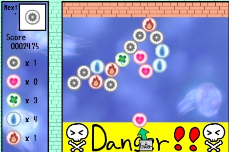
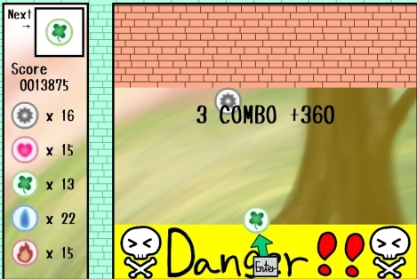

<a href="../../">TOP</a>
　＞　<a href="../">ゲーム紹介</a>
　＞　あめだまシューティング

あめだまシューティング

					

通称あめだまと呼ばれるものを3つくっつけると消える！
 
癒し系？のゲーム。高得点を取ってみんなに自慢しよう。

<h2>ゲーム画面</h2>

<h2>操作方法</h2>

マウスのみ
 
本作品では、ゲームスタートからゲームオーバー、リスタートまですべてマウスで操作可能です。
 
キーボードは一切使用しません。
 

<h2>動作環境</h2>

Windows8.1, Windows10, Ubuntu16.04 (全て64bit版)での動作を確認しています。

<h2>ダウンロード</h2>

<a href="https://box.yahoo.co.jp/guest/viewer?sid=box-l-26oalqoyfj6fl63uanefeuz3se-1001&uniqid=912fcc05-4537-4a2d-9098-ce81e9b38392&viewtype=detail">Windows版 （最終更新日 2017/10/27) </a> 

<a href="https://box.yahoo.co.jp/guest/viewer?sid=box-l-26oalqoyfj6fl63uanefeuz3se-1001&uniqid=06002405-eef5-4cee-8fbe-27aea31c9195&viewtype=detail">Linux版 （最終更新日 2017/10/27)</a>

<a href="https://github.com/hnctgpgk/Amedama">ソース</a>

<h2>免責事項</h2>

作者及び各リソースの制作者はこのゲームの利用により生じたいかなるトラブルや損害・損失に対し一切の責任を負いません。

<h2>クレジット、ライセンス</h2>

・ソースコード
 
Copyright (c) 2017 metal rad, hnctgpgk All Rights Reserved.
 
ライセンス: Apache License 2.0

・画像
 
Copyright (c) 2017 metal rad All Rights Reserved.
 
ライセンス: CC-BY

・フォント、音楽は以下のサイトの素材を使用させて頂いております。

敬称略
 
<a href="http://tanukifont.com">たぬきフォント</a>
 
<a href="http://amachamusic.chagasi.com/">甘茶の音楽工房</a>
 
<a href="https://maoudamashii.jokersounds.com/">魔王魂</a>
 
<a href="https://pocket-se.info">ポケットサウンド</a>
 
<a href="https://soundeffect-lab.info/">効果音ラボ</a>

素材について詳細は<a href="https://github.com/hnctgpgk/Amedama">こちらの下にあるマニュアル</a>を参照してください。

