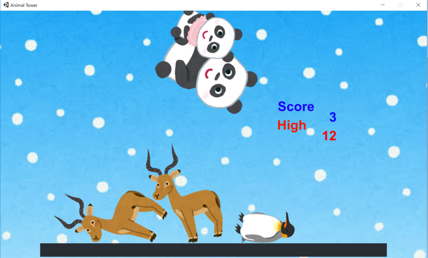

<a href="../../">TOP</a>
　＞　<a href="../">ゲーム紹介</a>
　＞　AnimalTower

<h1>
Animal Tower
</h1>

[操作方法]

① スペースキーを押すと色々な動物が出現します。 
② 右下の方向キーを左右に押して落とす場所を決められます。 
③ ALTキーで落とすときの角度を決められます。 
④ 左のCtrlキーで動物を下の土台に落とせます。 
⑤ 動物が溜まってきたら方向キーの上下で視点を変えられます。 

 

POINT

動物を落とせば落とすほど右上のスコアが増えていきます。 
出来るだけたくさん積み上げていってください。 
HighScoreを超えれば、随時更新されていきます。 
土台から動物が落ちたらGAMEOVERとなり、タイトルに戻ります。 
タイトル画面ではスペースキー、ALTキー、Ctrlキーでもう一度ゲームを始めることができます 

<h1>
動物をたくさん落として自分だけのHighScoreを目指してください。
</h1>

  

 

<h2>動作環境</h2>

Windows10 (64bit版)
 
macOS 10.14 (Mojave)
 
ubuntu 18.04 (64bit版)

<h2>ダウンロード</h2>

<a href="https://box.yahoo.co.jp/guest/viewer?sid=box-l-26oalqoyfj6fl63uanefeuz3se-1001&uniqid=495b628d-309e-412c-a9ad-346a33e67d7b&viewtype=detail">Windows版 （最終更新日 2018/12/22) </a>

<a href="https://box.yahoo.co.jp/guest/viewer?sid=box-l-26oalqoyfj6fl63uanefeuz3se-1001&uniqid=de04f30a-e2ae-4ae3-981c-15f8638e9f16&viewtype=detail">Mac版 （最終更新日 2018/12/22) </a>

<a href="https://box.yahoo.co.jp/guest/viewer?sid=box-l-26oalqoyfj6fl63uanefeuz3se-1001&uniqid=69d66024-58ee-4ec9-8440-29cc75d2a7cc&viewtype=detail">ubuntu版 （最終更新日 2018/12/22) </a>

<h2>免責事項</h2>

作者及び各リソースの制作者はこのゲームの利用により生じたいかなるトラブルや損害・損失に対し一切の責任を負いません。

<h2>クレジット、ライセンス</h2>

Copyright (c) 2018, ？ All Rights Reserved.
 
ライセンス: <a href="../../other/HGPKLv1.html">HGPKL, Version 1</a>

ゲーム内で使用している素材について詳細は<a href="./readme.txt">こちら</a>を参照してください。

