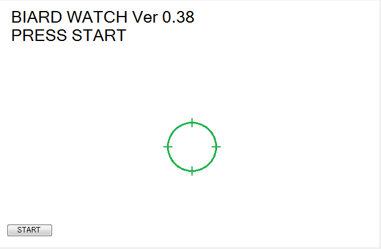
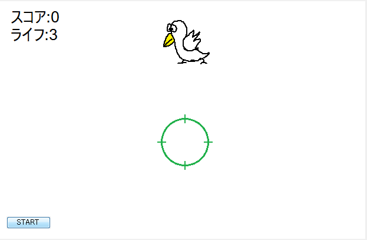

<a href="../../">TOP</a>
　＞　<a href="../">ゲーム紹介</a>
　＞　BIRD WATCH

BIRD WATCH

<h2>取り扱い説明</h2>

<h2>ストーリー</h2>

ギヤヨーク暦350年、ダンドラ星は未曽有の危機に見舞われた。 
チ・キン軍の精鋭部隊「Crack-0」がガンジ銀河の星々を襲い始め、ダンドラ星はチ・キン軍に征服されるに至った。 
しかし、チ・キン軍からガンジ銀河を奪取するためにダンドラ星出身の若者、大豪院 翔循が立ち上がった。 
翔循はあの「ノンストップナイフ事件」を解決した伝説の戦士だ。 
チ・キン軍のエイリアンを殲滅し、ダンドラ星に平和を取り戻せ！ 
しかし、チ・キン軍では古代文明から採取した「ニワトリ」という名の生命体の細胞を復元させる計画が進んでいた・・・ 

<h2>基本操作</h2>

■キーボード 
矢印キー：キャラクターの移動 
スペースキー：球の発射 

<h2>スクリーンショット</h2>

 

<h2>対応プラットフォーム</h2>

本ソフトウェアは、Windows7での動作を保障します。

<h2>ダウンロード</h2>

<a href="https://drive.google.com/uc?export=download&id=1xXDuiflsb0luWmz6xapZyswUwbnxXj9U">
ダウンロード（最終更新日 2015/12/26) </a>

