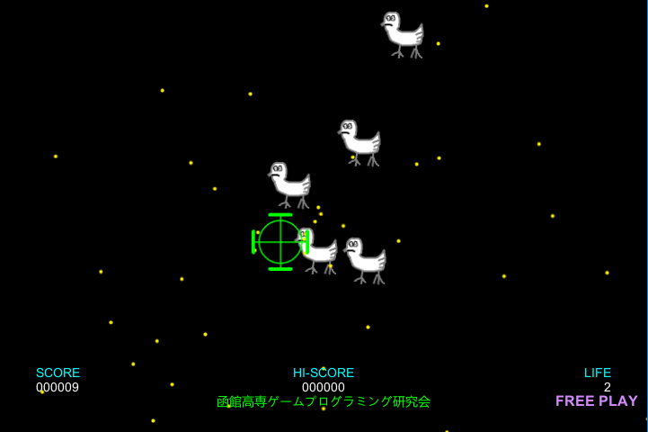

<a href="../../">TOP</a>
　＞　<a href="../">ゲーム紹介</a>
　＞　BIRD WATCH 2016

BIRD WATCH 2016

 

<b>
あの名作ゲームが最新鋭の技術で帰ってきた。 
ダンドラ星を奪還せよ！
</b>

<h2>取り扱い説明</h2>

このソフトは、Unityで制作されたゲームです。C#で制作されたされた<a href="../bird/">『BIRD WATCH』</a>をアレンジして収録しています。

<h2>ストーリー</h2>

ギヤヨーク暦350年、ダンドラ星は未曽有の危機に見舞われた。 
チ・キン軍の精鋭部隊「Crack-0」がガンジ銀河の星々を襲い始め、ダンドラ星はチ・キン軍に征服されるに至った。 
しかし、チ・キン軍からガンジ銀河を奪取するためにダンドラ星出身の若者、大豪院 翔循が立ち上がった。 
翔循はあの「ノンストップナイフ事件」を解決した伝説の戦士だ。 
チ・キン軍のエイリアンを殲滅し、ダンドラ星に平和を取り戻せ！ 
しかし、チ・キン軍では古代文明から採取した「ニワトリ」という名の生命体の細胞を復元させる計画が進んでいた・・・ 

※当時のホームページに記載された文章をもとにしています。 

<h2>基本操作</h2>

■キーボード 
矢印キー：キャラクターの移動 
スペースキー：球の発射 

<h2>対応プラットフォーム</h2>

本ソフトウェアは、Windows10、Ubuntu16.04 (64bit版)での動作を保障します。

<h2>ダウンロード</h2>

<a href="https://box.yahoo.co.jp/guest/viewer?sid=box-l-26oalqoyfj6fl63uanefeuz3se-1001&uniqid=1293a6f7-3bcc-424d-ae3a-d2d54e314ce3&viewtype=detail">ダウンロード（最終更新日 2016/11/22) </a>

<a href="https://box.yahoo.co.jp/guest/viewer?sid=box-l-26oalqoyfj6fl63uanefeuz3se-1001&uniqid=f4ddb6cd-88f5-4b06-8bb1-9c4f211c15cf&viewtype=detail">Linux版 （最終更新日 2016/11/22)</a>

<a href="https://github.com/hnct12335/BirdWatch">ソース</a>

<h2>免責事項</h2>

作者及び各リソースの制作者はこのゲームの利用により生じたいかなるトラブルや損害・損失に対し一切の責任を負いません。

<h2>クレジット、ライセンス</h2>

Copyright (c) 2017 hnct12335 All Rights Reserved.
 
ライセンス: Apache License 2.0

