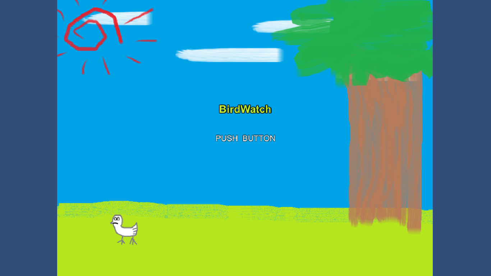
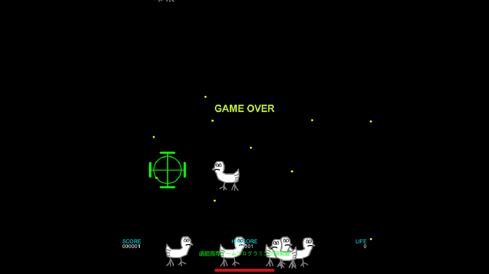

<a href="../../">TOP</a>
　＞　<a href="../">ゲーム紹介</a>
　＞　BIRD WATCH 2017

BIRD WATCH 2017

このソフトは、Unityで制作されたゲームです。
 
<a href="../bird/">『BIRD WATCH』</a>・<a href="../bird2016/">『BIRD WATCH 2016』</a>をアレンジして収録しています。
 
平成29年度1年生部員がBGMやSEを加えた2017年版BIRD WATCHになります。

<h2>ストーリー</h2>

ギヤヨーク暦350年、ダンドラ星は未曽有の危機に見舞われた。 
チ・キン軍の精鋭部隊「Crack-0」がガンジ銀河の星々を襲い始め、ダンドラ星はチ・キン軍に征服されるに至った。 
しかし、チ・キン軍からガンジ銀河を奪取するためにダンドラ星出身の若者、大豪院 翔循が立ち上がった。 
翔循はあの「ノンストップナイフ事件」を解決した伝説の戦士だ。 
チ・キン軍のエイリアンを殲滅し、ダンドラ星に平和を取り戻せ！ 
しかし、チ・キン軍では古代文明から採取した「ニワトリ」という名の生命体の細胞を復元させる計画が進んでいた・・・ 

※当時のホームページに記載された文章をもとにしています。 

<h2>ゲーム画面</h2>

<h2>基本操作</h2>

■キーボード 
矢印キー：キャラクターの移動 

<h2>動作環境</h2>

Windows10, Ubuntu16.04 (全て64bit版)での動作を確認しています。

<h2>ダウンロード</h2>

<a href="https://box.yahoo.co.jp/guest/viewer?sid=box-l-26oalqoyfj6fl63uanefeuz3se-1001&uniqid=9ddb940e-f661-4569-b41a-da46911ae87f&viewtype=detail">Windows版 （最終更新日 2017/10/28)</a>

<a href="https://box.yahoo.co.jp/guest/viewer?sid=box-l-26oalqoyfj6fl63uanefeuz3se-1001&uniqid=990b0fb1-6141-4a0e-8aa2-3f10553be36a&viewtype=detail">Linux版 （最終更新日 2017/10/28)</a>

ソース

<h2>免責事項</h2>

作者及び各リソースの制作者はこのゲームの利用により生じたいかなるトラブルや損害・損失に対し一切の責任を負いません。

<h2>クレジット、ライセンス</h2>

Copyright (c) 2016-2017 hnct12335, hoge, hoge, hoge  All Rights Reserved.
 
ライセンス: Apache License 2.0

音楽は以下のサイトの素材を使用させて頂いております。

BGM: <a href="https://maoudamashii.jokersounds.com/">魔王魂</a>様のサイトより<a href="https://maoudamashii.jokersounds.com/list/bgm11.html">8bit25</a>

SE: <a href="https://soundeffect-lab.info/">効果音ラボ</a>様のサイトより<a href="https://soundeffect-lab.info/sound/animal/">ニワトリの鳴き声</a>

