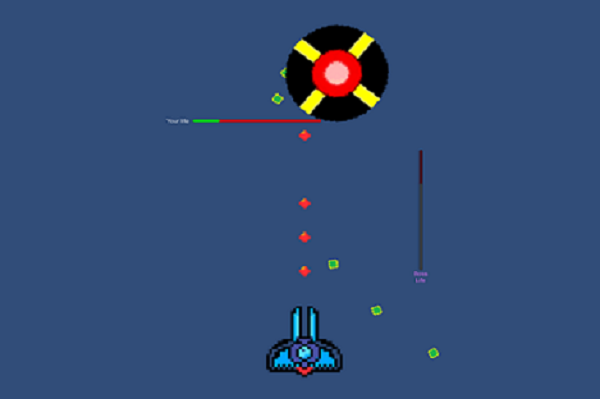

<a href="../../">TOP</a>
　＞　<a href="../">ゲーム紹介</a>
　＞　The Black

The Black

					
<h2>ストーリー</h2>

Dr.Yが作り出した黒の世界。 
地球を侵略し、黒に染めんとする黒の世界の王様「黒の人」。 
黒の人が遣わせし黒の世界の住人により、地球は危機に陥っていた・・・ 
迫りくる悪を払いのけ、地球を救ってください。 

<h2>ゲーム画面</h2>

<h2>操作方法</h2>

方向キーで移動。 
'Z'キーでショット(長押しで連続的に出せます)。 

<h2>動作環境</h2>

Windows10, Ubuntu16.04 (全て64bit版)での動作を確認しています。

<h2>ダウンロード</h2>

<a href="https://box.yahoo.co.jp/guest/viewer?sid=box-l-26oalqoyfj6fl63uanefeuz3se-1001&uniqid=b58bde96-a53b-4d1a-aaa0-ed8478684a6e&viewtype=detail">Windows版 （最終更新日 2017/10/29)</a>

<a href="https://box.yahoo.co.jp/guest/viewer?sid=box-l-26oalqoyfj6fl63uanefeuz3se-1001&uniqid=31bfa59b-8b24-4242-9d10-60e129cd34b5&viewtype=detail">Linux版 （最終更新日 2017/10/29)</a>

<h2>クレジット、ライセンス</h2>

Copyright (c) 2017 hoge, hoge All Rights Reserved.
 
ライセンス: <a href="../../other/HGPKLv1.html">HGPKL, Version 1</a>

・音楽は以下のサイトの素材を使用させて頂いております。

敬称略
 

