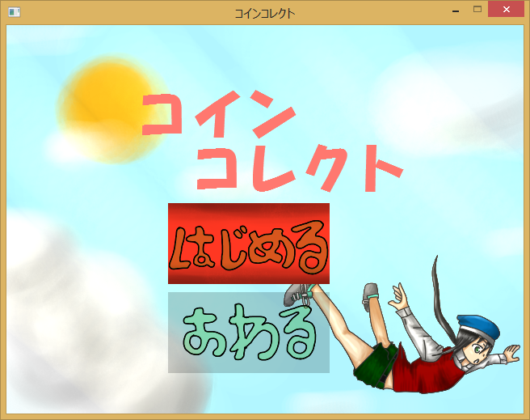
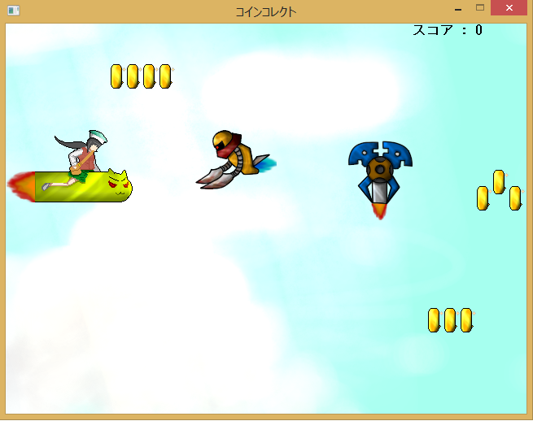

<a href="../../">TOP</a>
　＞　<a href="../">ゲーム紹介</a>
　＞　コインコレクト

コインコレクト

空を飛んでいる主人公を操ってコインを集めていくゲーム 
うまく敵を躱してコインを集めると友達に自慢できるぞ

<h2>システム紹介</h2>

この作品はボタン一つあれば操作することができるバリアフリーなゲームです 
zキーを押すことで浮力を発生させ、主人公を浮かすことができます 
z押す		→　浮く 
z離す		→　沈む 
中に入っているcsvファイルの数値を操作することでステージを自作できます

<h2>スクリーンショット</h2>

 

 

<h2>対応プラットフォーム</h2>

Windows7以降

<h2>ダウンロード</h2>

<a href="https://box.yahoo.co.jp/guest/viewer?sid=box-l-26oalqoyfj6fl63uanefeuz3se-1001&uniqid=e7d91610-a778-49f2-a159-e892de3f65b5&viewtype=detail">ダウンロード（最終更新日 2014/12/22) </a> 

