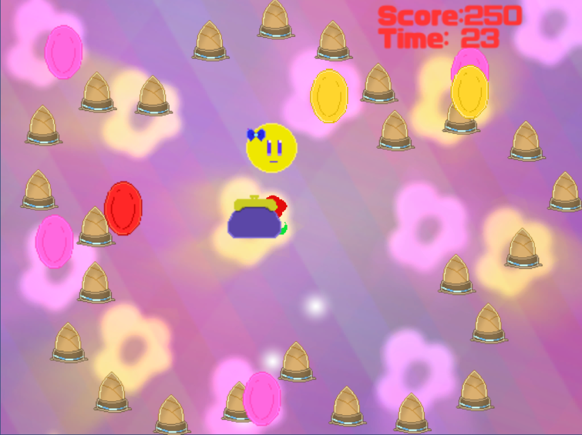
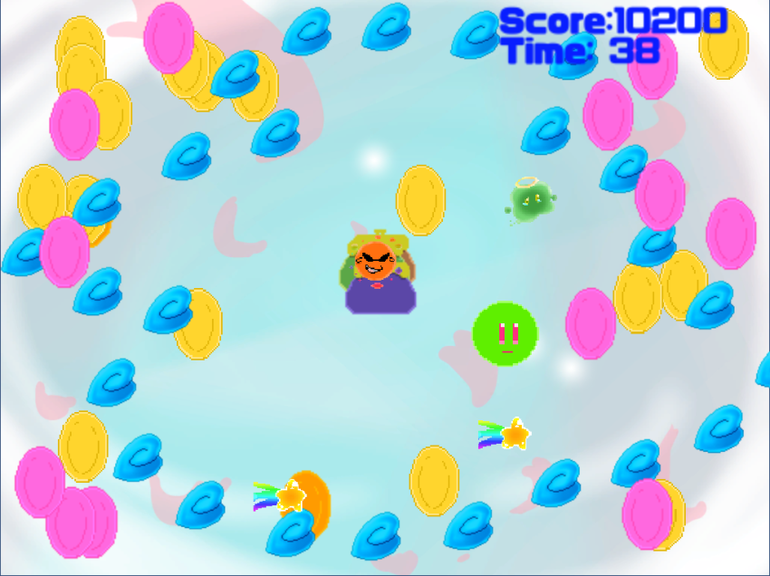

<a href="../../">TOP</a>
　＞　<a href="../">ゲーム紹介</a>
　＞　Coin!×3

Coin!×3

このゲームは、敵にぶつからないようにしてコインを集め、高得点を取るゲームとなっております。
 
得点に応じてエンディングが変化します。（全　3エンド）

<h2>ゲーム画面</h2>

<h2>操作方法</h2>

※マウス操作はありません

矢印キー：上下左右の移動
 
Xキー：決定や分身発射など
 
Escキー：ゲームを終わらせる

<h2>自機紹介</h2>

緑：分身を出しすぎても一時停止しない
 
黄色：移動速度は速いが分身を出しすぎると一時停止する

<h2>ステージ紹介</h2>

ステージ1：３０秒コース
 
ステージ2：６０秒コース
 
ステージ3：９０秒コース

ステージ3＞ステージ2＞ステージ1の順で難易度が低くなっております。

<h2>高得点のコツ</h2>

とにかく分身を駆使してコインを集めまくる！

※ステージ3では、とある緑色のキャラクタに触れることで一時的に素早くなれます。

<h2>動作環境</h2>

Windows10 (64bit版)
 
macOS 10.14 (Mojave)
 
ubuntu 18.04 (64bit版)

<h2>ダウンロード</h2>

<a href="https://box.yahoo.co.jp/guest/viewer?sid=box-l-26oalqoyfj6fl63uanefeuz3se-1001&uniqid=b5c3440d-c80a-4f07-8c6f-264e8679ec8e&viewtype=detail">Windows版 （最終更新日 2018/12/22) </a>

<a href="https://box.yahoo.co.jp/guest/viewer?sid=box-l-26oalqoyfj6fl63uanefeuz3se-1001&uniqid=ed8d32f4-4cfb-4ec7-adde-c01a759ccca1&viewtype=detail">Mac版 （最終更新日 2018/12/22) </a>

<a href="https://box.yahoo.co.jp/guest/viewer?sid=box-l-26oalqoyfj6fl63uanefeuz3se-1001&uniqid=1ea5ab8a-0cd5-4252-90e4-1a3004ec8689&viewtype=detail">ubuntu版 （最終更新日 2018/12/22) </a>

<h2>免責事項</h2>

作者及び各リソースの制作者はこのゲームの利用により生じたいかなるトラブルや損害・損失に対し一切の責任を負いません。

<h2>クレジット、ライセンス</h2>

Copyright (c) 2018, ？ All Rights Reserved.
 
ライセンス: <a href="../../other/HGPKLv1.html">HGPKL, Version 1</a>

ゲーム内で使用している素材について詳細は<a href="./readme.txt">こちら</a>を参照してください。

