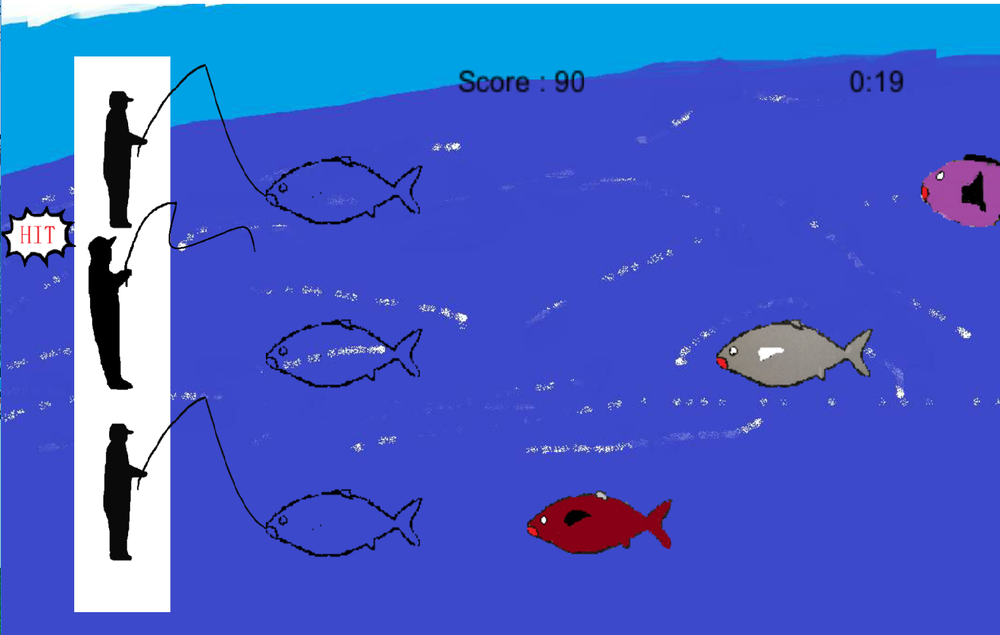
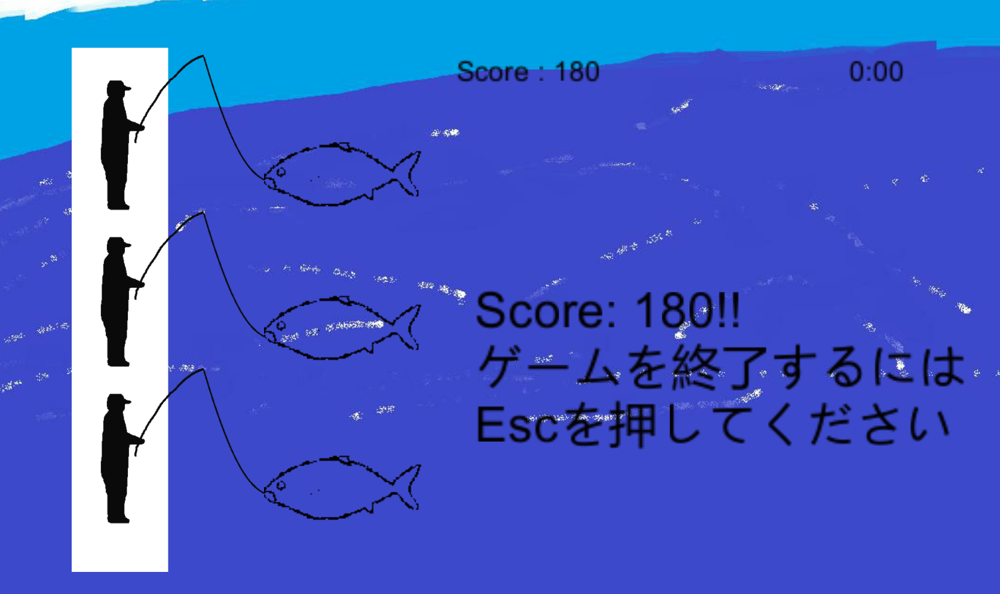

<a href="../../">TOP</a>
　＞　<a href="../">ゲーム紹介</a>
　＞　Strange Fishing

Strange Fishing

					

西暦最後の悲劇から30年後。
 
時は魚暦29年、某国の政府組織が開発した対魚型侵攻者用個人兵器を手に魚型侵攻者に抗う三人の男がいた…
 
我らの海を取り戻せ

<h2>ゲーム画面</h2>

<h2>操作方法</h2>

タイミングよくキーを押して魚を捕まえよう 
上の魚はWキー 
真ん中の魚はSキー 
下の魚はXキー 
でそれぞれ捕まえるよ 

<h2>動作環境</h2>

Windows10, Ubuntu16.04 (全て64bit版)での動作を確認しています。

<h2>ダウンロード</h2>

<a href="https://box.yahoo.co.jp/guest/viewer?sid=box-l-26oalqoyfj6fl63uanefeuz3se-1001&uniqid=0911ad8f-2f8e-4916-ace2-1a34d0bab5f7&viewtype=detail">Windows版 （最終更新日 2017/10/04)</a>

<a href="https://box.yahoo.co.jp/guest/viewer?sid=box-l-26oalqoyfj6fl63uanefeuz3se-1001&uniqid=fd1b41f9-01eb-4a45-a644-b08899465c6f&viewtype=detail">Linux版 （最終更新日 2017/10/04)</a>

<h2>クレジット、ライセンス</h2>

Copyright (c) 2016 hoge, hoge All Rights Reserved.
 
ライセンス: <a href="../../other/HGPKLv1.html">HGPKL, Version 1</a>

