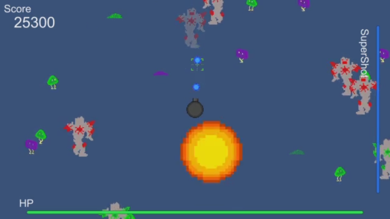

<a href="../../">TOP</a>
　＞　<a href="../">ゲーム紹介</a>
　＞　Fixed Battery

Fixed Battery

<h2>-説明書-</h2>

<h3>-操作方法-</h3>

<h4>コントローラー</h4>

本作品では、ゲームの操作をゲームパッド、マウスの2種類で行うことができます。 
タイトル画面でそれぞれ、"Play with Gamepad", "Play with Mouse"をマウスクリックすることで選ぶことができます。 
なお、ゲームパッドを選択した場合、キーボードでの操作が可能です。 

<h4>操作方法</h4>

<a href="./readme.txt">readme.txt</a>を参照してください。

<h3>-スクリーンショット-</h3>

<h3>-動作環境-</h3>

Windows8.1, Windows10での動作を確認しています。

<h3>-クレジット-</h3>

敬称略

<ul>
<li><a href="http://taira-komori.jpn.org/">無料効果音で遊ぼう！</a></li>
<li><a href="http://www.tam-music.com/">TAM Music Factory</a></li>
<li><a href="http://www.hmix.net/">H/MIX GALLERY</a></li>
</ul>

<h3>-ダウンロード-</h3>

<a href="https://box.yahoo.co.jp/guest/viewer?sid=box-l-26oalqoyfj6fl63uanefeuz3se-1001&uniqid=4cf50e45-d5c7-4d3d-a85d-74e32b3d74b8&viewtype=detail">ダウンロード（最終更新日 2016/10/19) </a>

