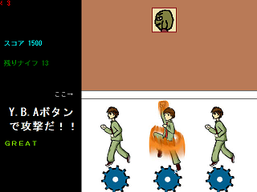

<a href="../../">TOP</a>
　＞　<a href="../">ゲーム紹介</a>
　＞　ＧＥＥＲ－ＹＯＫＥ

ＧＥＥＲ－ＹＯＫＥ

<h2>ＳＴＯＲＹ</h2>

西暦2623年 
地球は宇宙から襲来した未知の機械生命体によって占領されていた。 
機械生命体を撃退するために目下開発中の兵器「Doskoi Taratara OC-8933」 
その製造をしているカトウ、ヤマグチ、グレート＝ムラタ。 
しかし製造工場の設計ミスにより、天井から常にナイフが降ってくる！ 
さあ、爆撃コズミックパンチでナイフなんか粉々に粉砕するのだ！！ 

<h2>ゲームを始める</h2>

ダウンロードしたファイルを展開すると、「geer_yoke_(バージョン)」というファイルが作成されます。 
フォルダ構造は、このように なっています。

geer_yoke_(バージョン) 
	├img 
	├sound 
	└GAME_START(.exe)

「GAME_START(.exe)」をダブルクリックするとゲームが開始されます。

タイトル画面で[C]キーを押すと難易度選択画面に移動します。

この画面では、矢印キー上下で難易度を選択し、[C]キーで難易度を決定します。

<h2>操作方法</h2>

←アッパーには攻撃できる範囲があるのだ 
カトウ達の真上にある2本の線の中央と重なるようにナイフを攻撃すると高得点だぞ！

[Z][X][C]キーで爆撃コズミックパンチ（只のアッパー）を使用できます。 
[Z]キーはカトウ（一番左の青年）、[X]キーはヤマグチ（中央の美少年）、[C]キーはグレート＝ムラタ（一番右のナイスガイ）が、それぞれアッパーを繰り出します。

							

<h2>ゲームの終了</h2>

一定数のナイフが投下されるとゲームは終了されます。 
ゲーム終了後、得点確認画面が表示されます。 
更に数秒後にタイトル画面へと戻ります。 
アプリケーションを閉じるときにはタイトル画面で[Escape]キーを3秒間長押ししてください。

<h2>キャラクター</h2>

○カトウ・タカシ（加藤 高志） 
このゲームの主人公の一人。爆撃ナントカパンチの腕は達人級で、カラテの心得もある。だけどこの間ひったくりにあった、負けるなカトウ。

○ヤマグチ・ケンジ（山口 県次） 
このゲームの主人公の一人。岡山県出身。右眉毛に負傷を負っているのはミドリムシに襲われた時にカトウを庇って負った名誉の負傷。

○グレート＝ムラタ（田中 正平） 
このゲームの主人公の一人。ラーメン大好き。１日１杯食べても飽きない。でもメンマは嫌い。許さん。

○ハグルマタロウ（刃来 魔太郎） 
職場での扱いが悪く、ややノイローゼ気味。歯車にだって魂はあるんだ。

○センパイ（先輩 先次郎） 
カトウ達の先輩だったが、虎に襲われて帰らぬ人となった。彼が死ぬ前に言った言葉は「ザリガニ食いてぇ」。でもこの前あいつテレビに出てたよ、すごい音痴だった。

<h2>対応プラットフォーム</h2>

Windows7以降

<h2>ダウンロード</h2>

<a href="https://box.yahoo.co.jp/guest/viewer?sid=box-l-26oalqoyfj6fl63uanefeuz3se-1001&uniqid=012f3cbf-b4cb-48c4-a8c3-1545837743da&viewtype=detail">ダウンロード（最終更新日 2014/12/22) </a>

