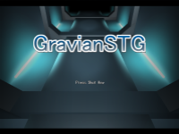
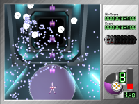
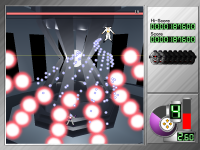
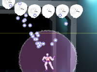
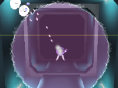

<a href="../../">TOP</a>
　＞　<a href="../">ゲーム紹介</a>
　＞　グラヴィアンシューティング

グラヴィアンシューティング

敵が発射してくる弾を重力で操る新感覚STG。 
重力の力で悪のエージェントどもを蹴散らそう。

<h2>人物紹介</h2>

 
グラヴィアン 
　本作の主人公。重力を操る力を持つ最強の宇宙海賊。 
　長い航海の末に手に入れた４次元エネルギーを奪われた事がきっかけで 
　ダンダールを倒す旅に出かける。

 
ダンダール 
　タイムマシンにより未来からやってきた科学者。 
　永久機関である４次元エネルギーを巡りグラヴィアンと対立する。 
　元は忍者らしく、科学者でありながらも身体能力はかなり高い。

 
機皇帝 
　世界征服を企むダンダールによって作られたロボット。 
　もの凄い戦闘能力を誇るがエネルギー消費量が半端ない。 
　永遠に活動できるようになるために無限のエネルギーを探し求めている。

 
手下ども 
　たくさんいる。

<h2>システム紹介</h2>

この作品では通常のSTG要素に加えて重力操作要素があります。 
ｘキーを押すことでグラヴィアンエネルギーを消費し重力場を発生させることができます。 
ｘのみ　　 →　斥力 
Shift＋ｘ　→　引力 

また、パワーを貯めることで重力場の性能が上がります。

<h2>ダウンロード</h2>

<a href="https://box.yahoo.co.jp/guest/viewer?sid=box-l-26oalqoyfj6fl63uanefeuz3se-1001&uniqid=2736e45b-2ce4-4417-ba70-2ece898a25e6&viewtype=detail">ダウンロード（最終更新日 2014/4/19）</a>

