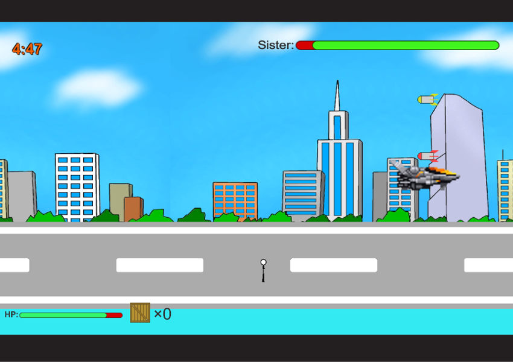

<a href="../../">TOP</a>
　＞　<a href="../">ゲーム紹介</a>
　＞　はじめてのお使いを邪魔するゲーム

はじめてのお使いを邪魔するゲーム

					
<h2>ストーリー</h2>

「行ってきまーす！」

今日はかわいい妹がはじめてのお使いに行く日だ。 
一人で行かせるのは不安だと思いながら見ていると、 
なんと家のガレージから戦闘機が！ 
17年生きてきて初めて見た戦闘機と 
そのすさまじい轟音に頭の中が真っ白になった。 
...はっ！このままでは町が危ない！ 
妹を止めなければ！

<h2>ゲーム画面</h2>

<h2>操作方法</h2>

<h4>マウスとキーボード</h4>

マウスカーソル:木箱を投げる位置を決めます 
左クリック:木箱を投げます 
[A]:左移動 
[D]:右移動 
[Space]:ジャンプ 

<h2>動作環境</h2>

Windows10, Ubuntu16.04 (全て64bit版)での動作を確認しています。

<h2>ダウンロード</h2>

<a href="https://drive.google.com/uc?export=download&id=1jph_RVUuxmCH6s8vjDlYmnwNqnLdckB5">
Windows版 （最終更新日 2017/12/13)</a>

<a href="https://drive.google.com/uc?export=download&id=1Q-alUWNDx6vNFzV7mmqC2LzRsuT0CPhV">
Linux版 （最終更新日 2017/12/13)</a>

<h2>クレジット、ライセンス</h2>

Copyright (c) 2017-2018 川崎,高橋 All Rights Reserved.
 
ライセンス: <a href="../../other/HGPKLv1.html">HGPKL, Version 1</a>

画像は以下のサイトの素材を使用させて頂いております。

戦闘機: <a href="http://mfstg.web.fc2.com/material/index.html">RECLUSE</a> 様

音楽・SE は以下のサイトの素材を使用させて頂いております。 

タイトルBGM: <a href="http://amachamusic.chagasi.com/music_famipop3.html">甘茶の音楽工房</a> 様 
 
ゲームBGM: <a href="https://maoudamashii.jokersounds.com/core.cgi?page=3&field=%E3%82%B2%E3%83%BC%E3%83%A0%E9%9F%B3%E6%A5%BD%E7%B4%A0%E6%9D%90%3C%3E%E6%88%A6%E9%97%98%E6%9B%B2">魔王魂</a> 様
 
爆発: <a href="https://on-jin.com/sound/sen.php?kate=%E7%88%86%E7%99%BA%E3%83%BB%E8%A1%9D%E6%92%83">音人</a> 様

