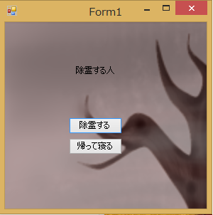
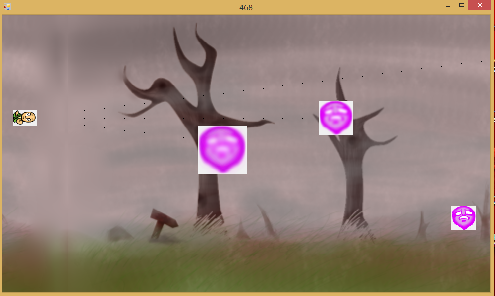
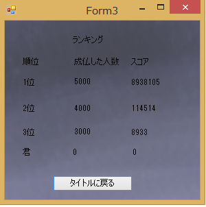

<a href="../../">TOP</a>
　＞　<a href="../">ゲーム紹介</a>
　＞　除霊する人

除霊する人

お坊さんを操作して迫りくる悪霊どもを蹴散らすスタイリッシュシューティングゲーム 
難易度が高めだからクリアできると友達に自慢できるぞ

<h2>システム紹介</h2>

スペース(旧版 ではzキー)を押すことで悪霊を成仏させるビームを撃つことができます 
十字キ―を使うことでお坊さんを操作できます 
悪霊に除霊ビームが当たると段々と膨らんで破裂(成仏)します。

<h2>スクリーンショット (旧版)</h2>

 

 

<h2>対応プラットフォーム</h2>

Unity版: Windows10 以降、macOS Mojave 以降

旧版: Windows7以降

<h2>ダウンロード</h2>

Unity版 (Win用) <a href="https://box.yahoo.co.jp/guest/viewer?sid=box-l-26oalqoyfj6fl63uanefeuz3se-1001&uniqid=12e6ac25-f546-460e-b790-638bcbd25e12&viewtype=detail">ダウンロード（最終更新日 2019/8/13) </a>

Unity版 (Mac用) <a href="https://box.yahoo.co.jp/guest/viewer?sid=box-l-26oalqoyfj6fl63uanefeuz3se-1001&uniqid=56eb81e2-f5c5-4506-be31-df98cd3a313e&viewtype=detail">ダウンロード（最終更新日 2019/8/13) </a>

旧版 (Win用): <a href="https://box.yahoo.co.jp/guest/viewer?sid=box-l-26oalqoyfj6fl63uanefeuz3se-1001&uniqid=dbd7c4b9-9654-4cb3-a478-83b440daa4e6&viewtype=detail">ダウンロード（最終更新日 2015/12/26) </a>

