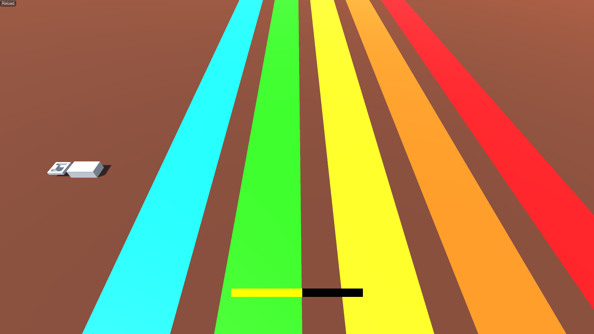

<a href="../../">TOP</a>
　＞　<a href="../">ゲーム紹介</a>
　＞　かくかく玉

かくかく玉

<h2>～概要～</h2>

かくかく玉（白いキューブ）を投石器で投げるゲームです。

全３ステージあり、赤いラインの上にかくかく玉を落とすと次のステージに進みます。

玉が赤いラインに当たっても転がってはみ出してしまったら次には進めません。

黄色いゲージが投石器の威力ゲージです。いい感じに調整して赤いラインに到達してください。

目指せ全ステージ突破！頑張ってください！

<h2>～ゲーム画面～</h2>

<h2>～操作方法～</h2>

・共通
 
エスケープキー: ゲーム終了

・タイトル画面
 
エンターキー：ゲーム開始

・ゲーム画面
 
スペースキー：かくかく玉（白いキューブ）を投げる
 
エンターキー：かくかく玉を投石器に戻す（玉が飛んでる間でも戻せます）
 
バックスペース：タイトル画面に戻る

・クリア画面
 
エンターキーorバックスペース：タイトル画面に戻る

<h2>～動作環境～</h2>

Windows 10 以降 (64 bit版)

macOS Big Sur 以降 (Universal 対応)

ubuntu 20.04 (64 bit版) 以降

(注意)

macOS 版で、もし「壊れているため開けません。ゴミ箱に入れる必要があります。」と表示されて起動できない場合は、ターミナルを開き、アプリを展開したフォルダに移動してから以下のコマンドを実行して下さい

$ xattr -rc kakukaku.app

<h2>～ダウンロード～</h2>

<a href="https://drive.google.com/uc?export=download&id=1m9uliUYYFuHrzVQotFav9_1wDoFcqyqp">
Windows版 （最終更新日 2022/1/2) </a>

<a href="https://drive.google.com/uc?export=download&id=10RYp1JiUnGj9nFZvvjUUlLvi-zcMeeq3">
macOS版 （最終更新日 2022/1/2)  </a>

<a href="https://drive.google.com/uc?export=download&id=1u-vfug1t22KCZZx4Jtv6p0rCX1d6uuSZ">
Linux版 （最終更新日 2022/1/2)  </a>

<h2>～免責事項～</h2>

作者及び各リソースの制作者はこのゲームの利用により生じたいかなるトラブルや損害・損失に対し一切の責任を負いません。

<h2>～クレジット、ライセンス～</h2>

Copyright (c) 2021 函館高専ゲームプログラミング研究会 All Rights Reserved.
 
ライセンス: <a href="../../other/HGPKLv1.html">HGPKL, Version 1</a>

ゲーム内で使用している素材について詳細は<a href="./readme.txt">こちら</a>を参照してください。

