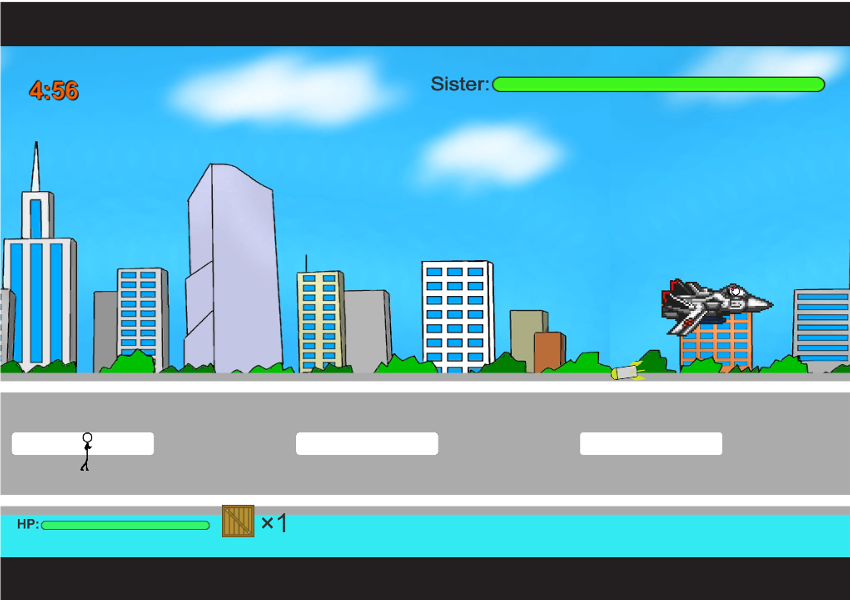
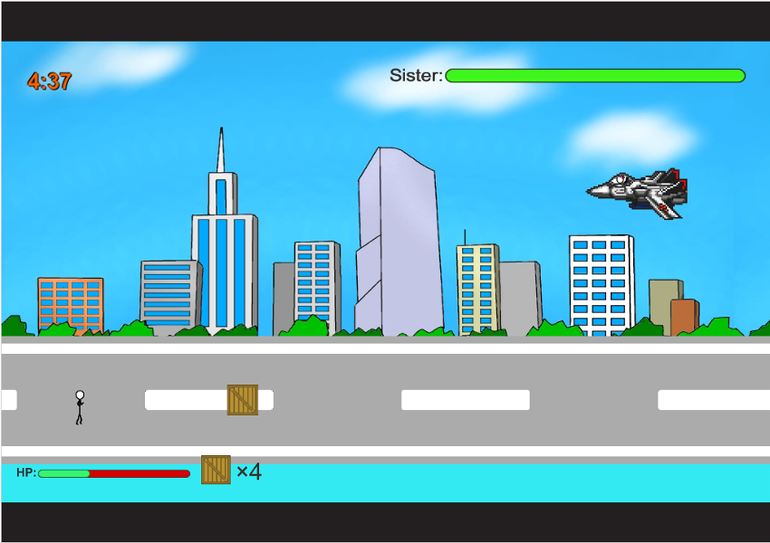

<a href="../../">TOP</a>
　＞　<a href="../">ゲーム紹介</a>
　＞　はじめてのお使いを邪魔するゲーム

はじめてのお使いを邪魔するゲーム

					

説明・ストーリー・・・準備中

<h2>ゲーム画面</h2>

<h2>操作方法</h2>

<h4>マウスとキーボード</h4>

マウスカーソル:木箱を投げる位置を決めます 
左クリック:木箱を投げます 
[A]:左移動 
[D]:右移動 
[Space]:ジャンプ 

<h2>動作環境</h2>

Windows10, Ubuntu16.04 (全て64bit版)での動作を確認しています。

<h2>ダウンロード</h2>

準備中

<h2>クレジット、ライセンス</h2>

Copyright (c) 2017 hoge, hoge All Rights Reserved.
 
ライセンス: <a href="../../other/HGPKLv1.html">HGPKL, Version 1</a>

・画像や音楽は以下のサイトの素材を使用させて頂いております。

敬称略
 

