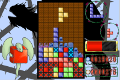

<a href="../../">TOP</a>
　＞　<a href="../">ゲーム紹介</a>
　＞　Puzzle＆Defence＆Dragons

Puzzle＆Defence＆Dragons

2013年度高専祭で発表したパズルゲームです。

<h2>スクリーンショット</h2>

 

 

<h2>対応プラットフォーム</h2>

対応プラットフォーム： Windows7以降

<h2>ダウンロード</h2>

<a href="https://drive.google.com/uc?export=download&id=1Vu0v5GMIrpwly54FJck_VD3nNSJMyelg">
ダウンロード（最終更新日 2014/4/13）</a>

