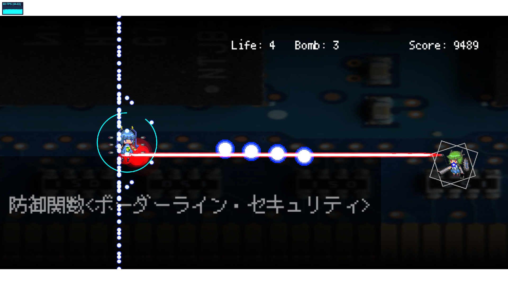

<a href="../../">TOP</a>
　＞　<a href="../">ゲーム紹介</a>
　＞　shooting-x

shooting-x

ドット絵風味の横スクロールSTG！
 
簡単操作で今すぐ弾幕の世界に飛び込もう！！

<h2>ゲーム画面</h2>

<h2>操作方法</h2>

弾の発射は自動で行われます。

・ エンターキー：
 
 
ゲーム開始 

・ 矢印キー：
 
 
上下左右の移動

・ Zキー： 
 
 
低速移動/レーザーモード
 
押している間レーザーによる強攻撃、低速移動になります

・ Xキー： 
 
 
ボム
 
3回まで敵の弾幕を消滅させます

・ スペースキー：
 
 
ポーズ画面

・ escキー： 
 
 
ゲームを終了します

・ delキー： 
 
 
スコアランキングリセット（タイトル画面のみ）

Windows、Linuxでは<a href="./shooting-x_manual.pdf">こちらのpdf</a>のようにゲームパッドも使うことができます。
 
環境によってはpdfとキー配置が異なることがありますのでご注意ください。

<h2>動作環境</h2>

Windows10, macOS Catalina, Ubuntu18.04 （すべて64bit版） での動作を確認しています。

<h2>ダウンロード</h2>

・高専祭2019 版

<a href="https://box.yahoo.co.jp/guest/viewer?sid=box-l-26oalqoyfj6fl63uanefeuz3se-1001&uniqid=341342ca-bff8-49fa-b302-6bb58eae7fc4&viewtype=detail">Windows版 （最終更新日 2020/1/18) </a>

<a href="https://box.yahoo.co.jp/guest/viewer?sid=box-l-26oalqoyfj6fl63uanefeuz3se-1001&uniqid=3544eab5-ab9f-4025-98af-a0ee219628a8&viewtype=detail">mac OS版 （最終更新日 2020/1/18) </a>

<a href="https://box.yahoo.co.jp/guest/viewer?sid=box-l-26oalqoyfj6fl63uanefeuz3se-1001&uniqid=b496da7f-2717-4fc8-923f-5e463175e6a5&viewtype=detail">Linux版 （最終更新日 2020/1/18) </a>

<h2>免責事項</h2>

作者及び各リソースの制作者はこのゲームの利用により生じたいかなるトラブルや損害・損失に対し一切の責任を負いません。

<h2>クレジット、ライセンス</h2>

Copyright(C) 2018-2020, 久米田 All Rights Reserved.
 
ライセンス: <a href="../../other/HGPKLv2.html">HGPKL, Version 2</a>

ゲーム内で使用している素材について詳細は<a href="./readme.txt">こちら</a>を参照してください。

