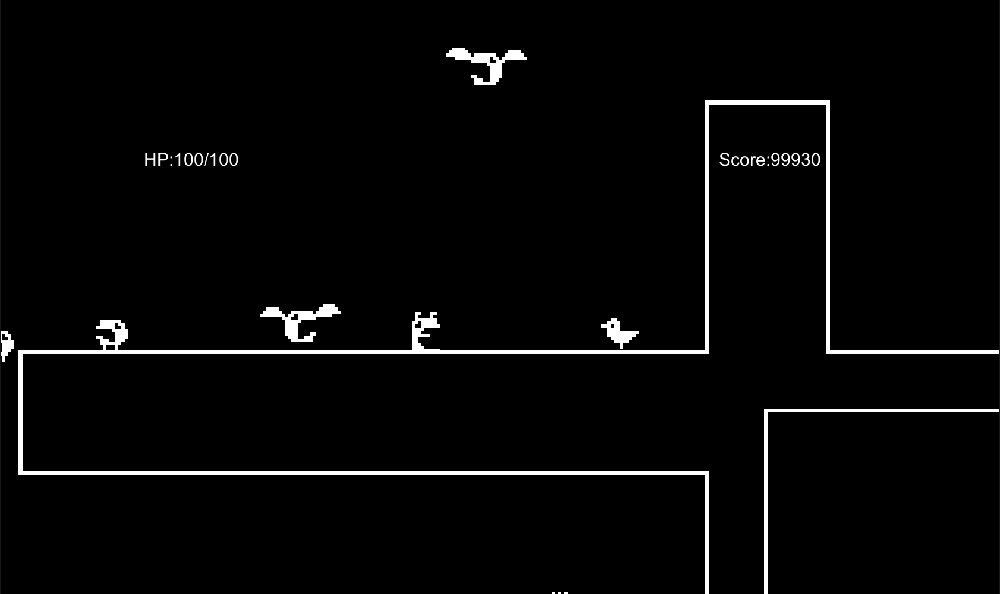

<a href="../../">TOP</a>
　＞　<a href="../">ゲーム紹介</a>
　＞　進化する鳥

進化する鳥

<h2>～概要～</h2>

敵を倒して出てくるアイテムを集めると鳥が強化される。

どんどん強化してダンジョンの奥に進んでいこう。

<h2>～ゲーム画面～</h2>

<h2>～操作方法～</h2>

・タイトル画面

スペース: ゲーム開始

Escキー: ゲーム終了

 

・ゲーム画面

左右キー: 移動

スペース: ジャンプ

Zキー: 弾の発射(押しっぱなしで連射)

Escキー: タイトルに戻る

<h2>～動作環境～</h2>

Windows 10 (64 bit版)

macOS Catalina

ubuntu 18.04 (64 bit版)

<h2>～ダウンロード～</h2>

<a href="https://drive.google.com/uc?export=download&id=1PA6p-t0yelLjMc1bYpetI3eHEahWnBKr">
Windows版 （最終更新日 2020/03/06) </a>

<a href="https://drive.google.com/uc?export=download&id=1S-n9-vFsYyMcyCz3KyXjqPLy0ZpPmaSp">
 macOS版 （最終更新日 2020/03/06) </a>

<a href="https://drive.google.com/uc?export=download&id=153bdvcmz1IwIJLIKHKcCJaWDR_BL6XGJ">
ubuntu版 （最終更新日 2020/03/06) </a>

<h2>～免責事項～</h2>

作者及び各リソースの制作者はこのゲームの利用により生じたいかなるトラブルや損害・損失に対し一切の責任を負いません。

<h2>～クレジット、ライセンス～</h2>

Copyright (c) 2019,2020 佐藤 All Rights Reserved.
 
ライセンス: <a href="../../other/HGPKLv1.html">HGPKL, Version 1</a>

ゲーム内で使用している素材について詳細は<a href="./readme.txt">こちら</a>を参照してください。

