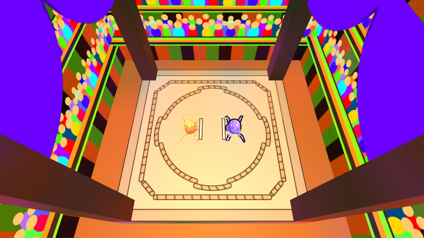
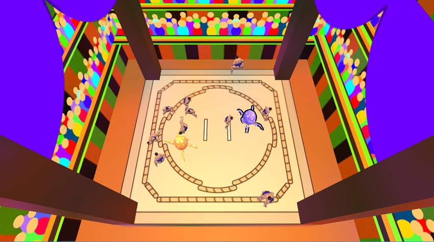

<a href="../../">TOP</a>
　＞　<a href="../">ゲーム紹介</a>
　＞　Squid's Sumou

Squid's Sumou

イカ対イカの相撲バトル！！
 
イカスミを飛ばして相手を落とそう！
 
相撲の最中は重さ３ｔの力士が降ってくるぞ！気を付けよう！

<h2>ゲーム画面</h2>

<h2>操作方法</h2>

紫イカ

↑・・・前移動
 
↓・・・下移動
 
→・・・右回転
 
←・・・左回転
 
Enter ・・・ イカスミを飛ばす

黄色イカ

W・・・前移動
 
S・・・下移動
 
A・・・右回転
 
D・・・左回転
 
Space ・・・ イカスミを飛ばす

ゲームの終了方法
 
Alt key + F4

<h2>動作環境</h2>

Windows10 (64bit版)での動作を確認しています。

<h2>ダウンロード</h2>

<a href="https://drive.google.com/uc?export=download&id=1hoBUS_cLThQp78rExLgEPunWUeXkX2pt">
Windows版 （最終更新日 2018/5/24) </a>

<h2>免責事項</h2>

作者及び各リソースの制作者はこのゲームの利用により生じたいかなるトラブルや損害・損失に対し一切の責任を負いません。

<h2>クレジット、ライセンス</h2>

Copyright (c) 2018, 中村, 高橋, 瀧川  All Rights Reserved.
 
ライセンス: <a href="../../other/HGPKLv1.html">HGPKL, Version 1</a>

ゲーム内で使用している素材について詳細は<a href="./readme.txt">こちら</a>を参照してください。

