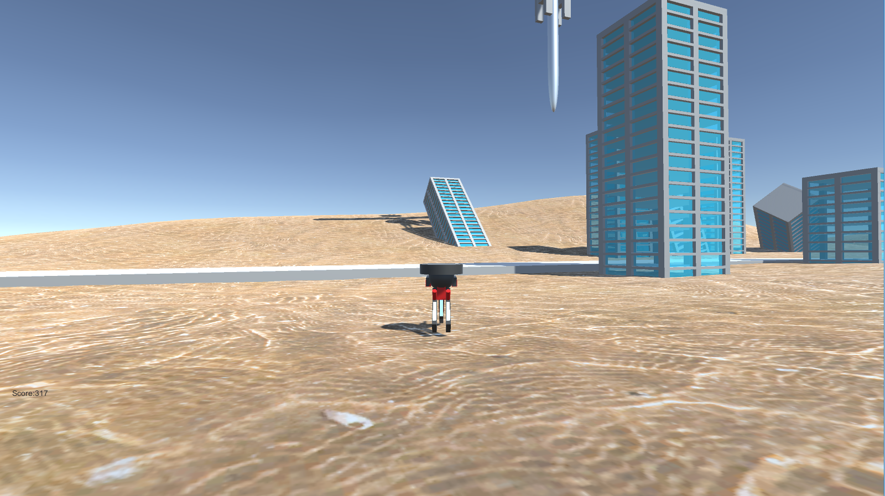
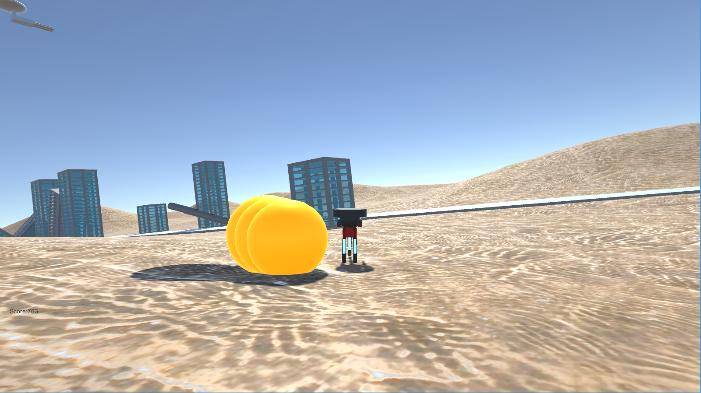
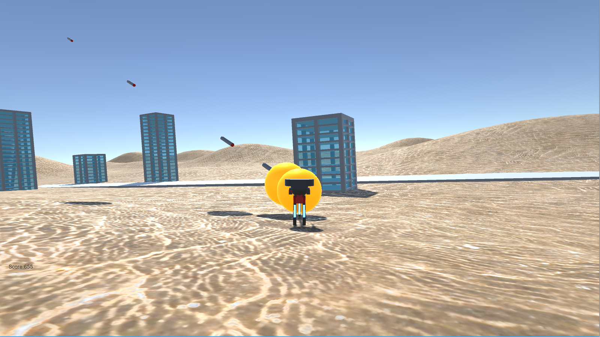

<a href="../../">TOP</a>
　＞　<a href="../">ゲーム紹介</a>
　＞　偵察機の災難

偵察機の災難 〜おぼえてろよ上層部〜

<h2>～概要～</h2>

ミッションを説明します。

場所は旧市街地となります。
 
ミッション内容は至って単純、敵の攻撃を避け続けるというものです。
 
言ってしまえば本隊が来るまでの時間稼ぎですね。
 
敵戦力である浮遊要塞は先の戦闘で武装のほとんどが破壊されており、残っているのは僅かばかりのミサイルのみとなっています。

まぁ、この程度の弾幕、あなたの敵ではないとおもいますが？
 
なお、先程も述べた通りこのミッションは時間稼ぎが目的となっているため逃げ続けた時間に応じてボーナスが支払われます。

ミッションの説明は以上です。良い結果を期待してます。

<h2>～ゲーム画面～</h2>

<h2>～操作方法～</h2>

上下矢印キー:前後移動

左右矢印キー:左右移動

スペースキー:スタート、リスタート

Escキー:ゲーム終了

スコア:画面左端　見にくくてゴメン！

ヒント:建物などに触れると大ジャンプできるぞ！

ー今この瞬間は、回避こそ全てだ‼ー

<h2>～動作環境～</h2>

Windows 10 (64 bit版)

ubuntu 18.04 (64 bit版)

<h2>～ダウンロード～</h2>

<a href="https://box.yahoo.co.jp/guest/viewer?sid=box-l-26oalqoyfj6fl63uanefeuz3se-1001&uniqid=74034453-cf97-4295-a8bf-b3892178df73&viewtype=detail">
Windows版 （最終更新日 2020/1/11) </a>

<a href="https://box.yahoo.co.jp/guest/viewer?sid=box-l-26oalqoyfj6fl63uanefeuz3se-1001&uniqid=255755df-a6f2-4839-903d-8b212c969451&viewtype=detail">
ubuntu版 （最終更新日 2020/1/11) </a>

<h2>～免責事項～</h2>

作者及び各リソースの制作者はこのゲームの利用により生じたいかなるトラブルや損害・損失に対し一切の責任を負いません。

<h2>～クレジット、ライセンス～</h2>

Copyright(C) 2019, 偵察機の災難 All Rights Reserved.
 
ライセンス: <a href="../../other/HGPKLv1.html">HGPKL, Version 1</a>

