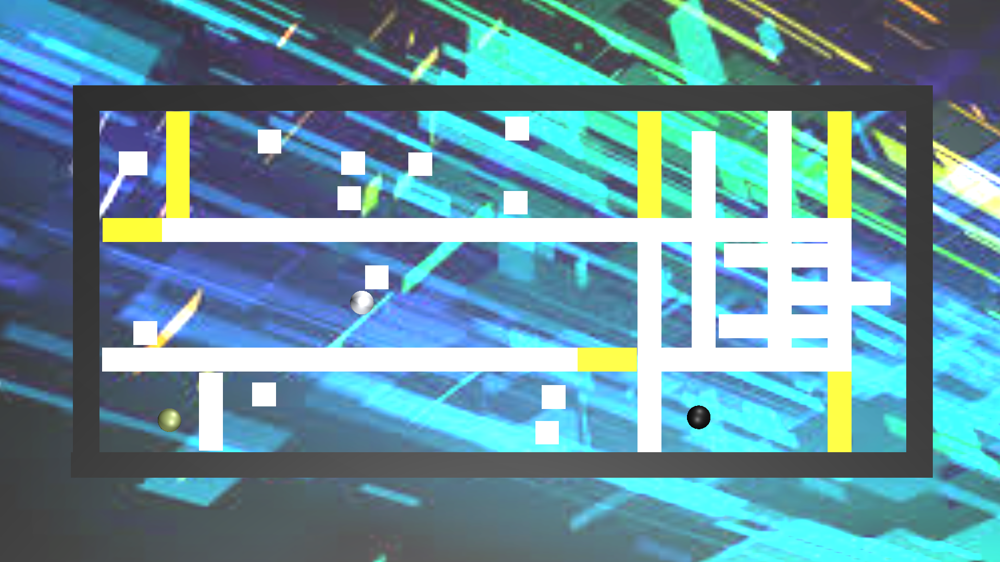
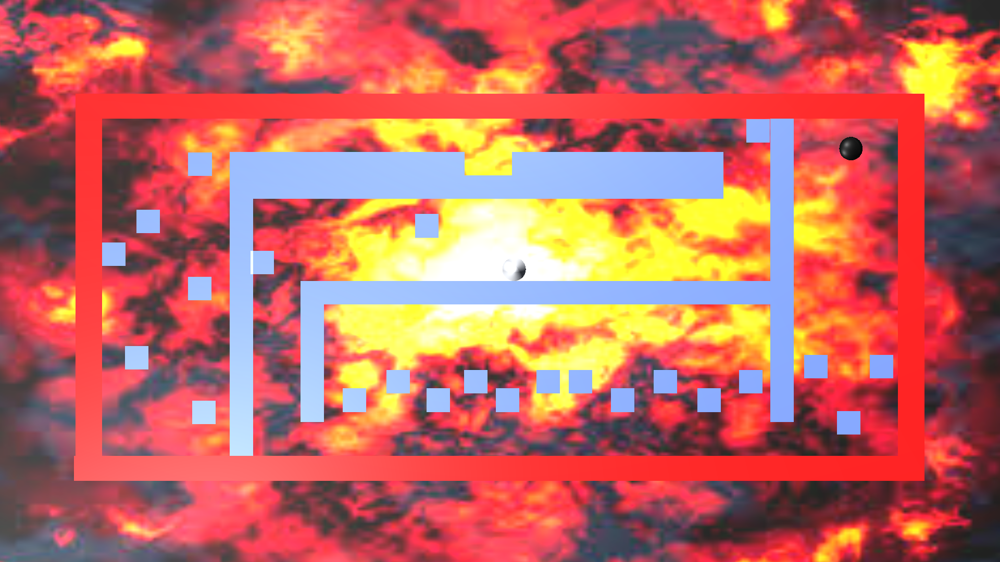

<a href="../../">TOP</a>
　＞　<a href="../">ゲーム紹介</a>
　＞　THROUGH

THROUGH

<h2>～概要～</h2>

イライラ棒みたいなゲームです。

壁は触れても大丈夫です。

<h2>～ゲーム画面～</h2>

<h2>～操作方法～</h2>

矢印キーで移動。（同時押しで斜めも可。）

スペースキーでステージセレクトに戻れます。

<h2>～動作環境～</h2>

準備中

<h2>～ダウンロード～</h2>

準備中

<h2>～免責事項～</h2>

作者及び各リソースの制作者はこのゲームの利用により生じたいかなるトラブルや損害・損失に対し一切の責任を負いません。

<h2>～クレジット、ライセンス～</h2>

Copyright(C) 2019, THROUGH All Rights Reserved.
 
ライセンス: <a href="../../other/HGPKLv1.html">HGPKL, Version 1</a>

