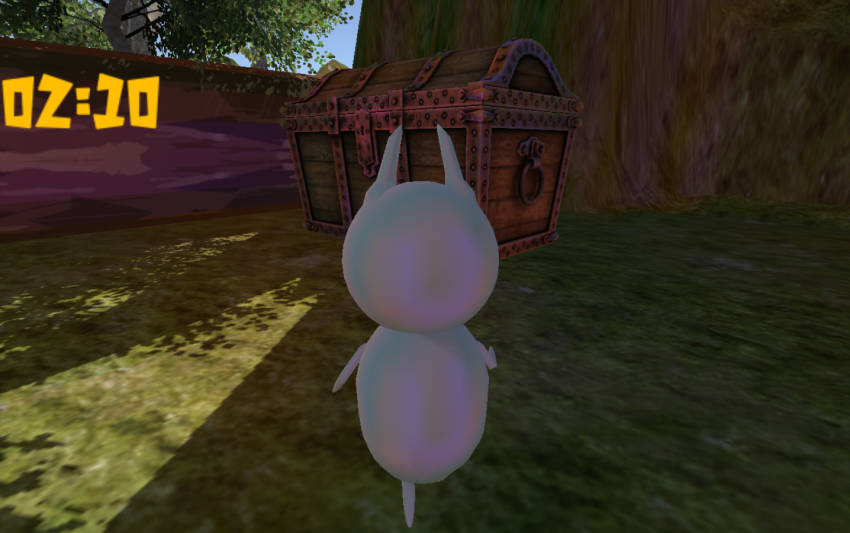

<a href="../../">TOP</a>
　＞　<a href="../">ゲーム紹介</a>
　＞　TREASURE OF THE JUNGLE

TREASURE OF THE JUNGLE

<h2>～概要～</h2>

主人公のリクがジャングルを舞台にお宝探して走る3Dアクションゲームです。ジャンプや方向転換で木や動物などの障害物を避けてゴールを目指すタイムアタックです。

ジャングルの奥に眠るお宝を手に入れよう！

ステージのどこかにある宝箱を探し出し、お宝を入手するとゲームクリア、ステージにある崖から落ちるとゲームオーバーになります。

障害物に接触すると主人公の動きが3秒間停止します。

<h2>～ゲーム画面～</h2>

<h2>～操作方法～</h2>

■キーボード

カーソル(上)：前進
 
カーソル(左右)：方向転換
 
スペース：ジャンプ
 
Esc：ゲームを終了

■ゲームパッド

左スティック：前進、方向転換
 
Xボタン：ジャンプ
 
Bボタン：ゲームを終了
 
Aボタン：決定(メニュー内)

<h2>～動作環境～</h2>

Windows10 (64bit版)
 
macOS 10.14 (Mojave)
 
ubuntu 18.04 (64bit版)

<h2>～ダウンロード～</h2>

<a href="https://box.yahoo.co.jp/guest/viewer?sid=box-l-26oalqoyfj6fl63uanefeuz3se-1001&uniqid=80bfdd3f-6064-4680-ac4a-65d05dff83b0&viewtype=detail">
Windows版 （最終更新日 2019/1/23) </a>

<a href="https://box.yahoo.co.jp/guest/viewer?sid=box-l-26oalqoyfj6fl63uanefeuz3se-1001&uniqid=55b99e79-38e9-4e98-80cb-c8751739f4c1&viewtype=detail">
Mac版 （最終更新日 2019/1/23) </a>

<a href="https://box.yahoo.co.jp/guest/viewer?sid=box-l-26oalqoyfj6fl63uanefeuz3se-1001&uniqid=60fd5b57-6420-4519-837c-039ed76e0ef9&viewtype=detail">
ubuntu版 （最終更新日 2019/1/23) </a>

<h2>～免責事項～</h2>

作者及び各リソースの制作者はこのゲームの利用により生じたいかなるトラブルや損害・損失に対し一切の責任を負いません。

<h2>～クレジット、ライセンス～</h2>

Copyright(C) 2018, ToJ All Rights Reserved.
 
ライセンス: <a href="../../other/HGPKLv1.html">HGPKL, Version 1</a>

ゲーム内で使用している素材について詳細は<a href="./readme.txt">こちら</a>を参照してください。

